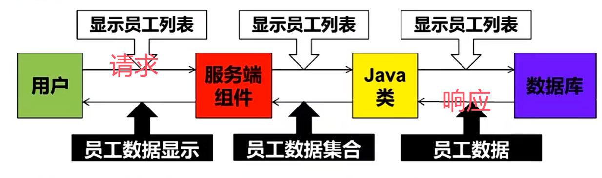
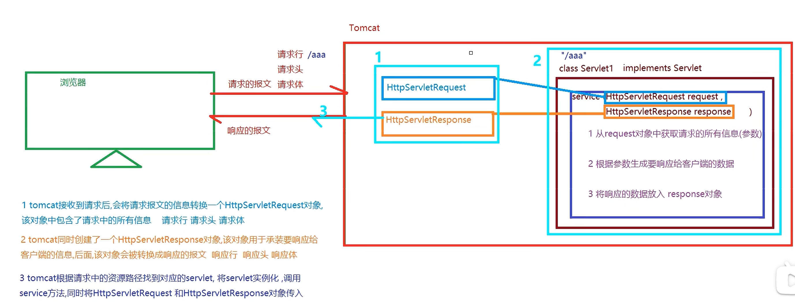
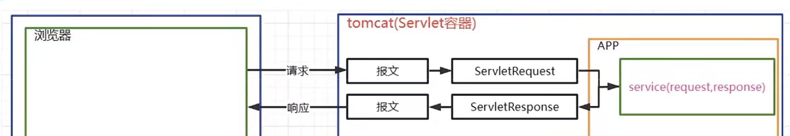

# JavaWeb 学习笔记

因个人偏好，暂时跳过 html css js 三件套。

## Tomcat

### 简介

* 为 **Java Servlet** 和 **JSP** 提供运行环境。
* 是一个轻量级的 Web 服务器。
* 是 Java Web 应用的标准部署容器。


## HTTP

### 简介

#### 基本概念

* HTTP 是用于传输超文本的应用层写译
* 其特点为：
  * **无状态**：服务器不记录其客户端状态（依赖 cookie/session 解决）
  * **基于请求-响应模型**：客户端发起请求，服务器返回响应。
  * **可拓展**：通过 Headers 和 body 灵活传递数据。核心术语

 ### 请求与响应结构 

* 请求格式

  ```http
  GET /path?param = value HTTP/1.1
  Host: example.com
  User-Agent: Mozilla/5.0
  Accept: text/html
  
  [请求体]（POST 数据之类）
  ```

* **常用请求方式**

  | 方法   | 用途                 |
  | :----- | :------------------- |
  | GET    | 获取资源             |
  | POST   | 提交数据             |
  | PUT    | 更新资源             |
  | DELETE | 删除资源             |
  | HEAD   | 获取头信息（无 body） |

* 响应格式

  ```html
  HTTP/1.1 200 OK
  Content-Type: text/html	
  Content-Length: 1234
  
  <!DOCTYPE html>
  <html>...</html>
  ```

* **常用响应码**

  | 状态码 | 类别       | 说明           |
  | ------ | ---------- | -------------- |
  | 200    | 成功       | 请求成功       |
  | 301    | 重定向     | 资源永久移动   |
  | 404    | 客户端错误 | 资源不存在     |
  | 500    | 服务器错误 | 服务器内部错误 |

## Servlet

### **Servlet 简介**

#### **定义**

- **Servlet** 是 Java 编写的**服务器端程序**，用于处理客户端的 HTTP 请求并生成动态响应。
- 运行在 **Servlet 容器**（如 Tomcat、Jetty）中，容器负责管理其生命周期和网络通信。

#### **核心作用**

**承前启后**

- **接收请求**：解析 HTTP 请求（参数、Headers 等）。
- **处理业务**：执行 Java 代码逻辑。
- **生成响应**：返回 HTML、JSON 或其他格式的数据。

####  **主要特性**

- **平台无关**：基于 Java，跨操作系统。
- **高效性**：多线程处理请求（每个请求由独立线程处理）。
- **可扩展性**：可通过 Filter、Listener 增强功能。


### **Servlet 运行流程**







**详细步骤**

1. **客户端发起请求**
   浏览器通过 URL 发起 HTTP 请求。
2. **容器接收请求**
   Servlet 容器监听到请求，解析 URL 确定目标 Servlet。
3. **创建 Request/Response 对象**
   - 容器封装 HTTP 请求数据为 `HttpServletRequest` 对象。
   - 创建空的 `HttpServletResponse` 对象用于填充响应数据。
4. **调用 Servlet 的 service() 方法**
   - 容器根据请求方法调用对应的 `doGet()` 或 `doPost()` 方法。
   - 若未重写这些方法，默认返回 `HTTP 405` 错误（方法不支持）。
5. **执行业务逻辑**
   - 在 `doGet()` 或 `doPost()` 中编写业务代码。
   - 通过例如 `response.getWriter().write("Hello World")` 的语句输出响应内容。
6. **返回响应**
   - 容器将 `HttpServletResponse` 中的内容转换为 HTTP 响应报文。
   - 客户端浏览器渲染响应结果。

简单示例如下：

```java
@WebServlet("/hello")
public class HelloServlet extends HttpServlet {
    @Override
    protected void doGet(HttpServletRequest request, HttpServletResponse response) 
            throws ServletException, IOException {
        response.setContentType("text/html");
        PrintWriter out = response.getWriter();
        out.println("<h1>Hello, World!</h1>");
    }
}
```


