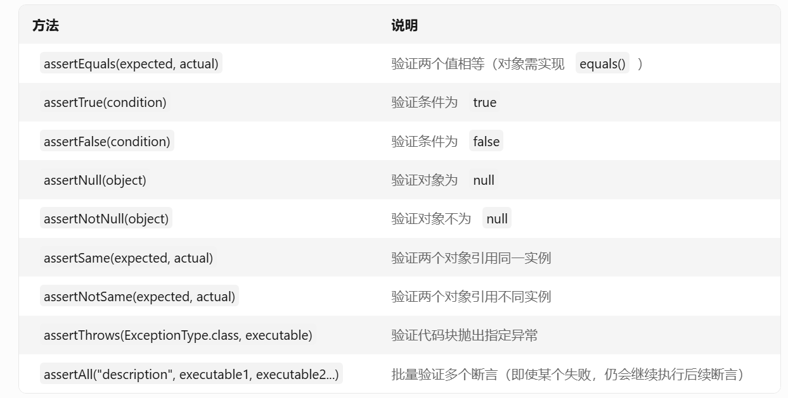

 # JUnit 断言（Assertions）
 * 用途：通过比较实际结果与预期结果来判断测试是否通过，如果断言失败，测试会立即终止并抛出错误信息。

    //1. ​验证非空返回值
    @Test
    void testReturnNotNull() {
    String result = someMethod(); // 调用被测试方法
    assertNotNull(result); // 验证返回值不为null
    }

    //2. ​验证具体值
    @Test
    void testAdd() {
    int result = calculator.add(2, 3); // 假设被测试方法返回 5
    assertEquals(5, result); // 验证返回值等于5
    }
    

    //3. ​验证布尔值
     @Test
    void testIsEven() {
    boolean result = numberUtil.isEven(4); // 假设返回 true
    assertTrue(result); // 验证为true
    }

    //4. ​验证集合或数组
    @Test
    void testGetList() {
    List<String> result = service.getList();
    // 验证集合非空且包含特定元素
    assertNotNull(result);
    assertTrue(result.contains("apple"));
    }

    @Test
    void testArray() {
    int[] expected = {1, 2, 3};
    int[] result = someMethod(); // 返回数组
    assertArrayEquals(expected, result); // 验证数组内容一致
    }

    //5. ​验证对象属性
    @Test
    void testUserInfo() {
    User user = userService.getUserById(1);
    assertEquals("Alice", user.getName()); // 验证对象属性
    assertEquals(30, user.getAge());
    }

### ​无返回值的方法（void）​
若方法返回 void，通常通过以下方式验证：

* ​状态变更：检查对象状态是否被修改。
* ​副作用：例如是否写入数据库、发送消息等
* ​异常抛出：验证是否抛出预期异常。

示例如下：

    @Test
    void testUpdateUser() {
    User user = new User("Bob", 25);
    userService.updateUser(user); // void方法
    // 假设通过其他方法验证状态变更
    User updatedUser = userService.getUserByName("Bob");
    assertEquals(25, updatedUser.getAge());
    }

* 值得注意的是 Assertion的方法无法作为if的判断条件。
* 因为if的判断条件依赖bool，而assertion通常没有返回值（void）